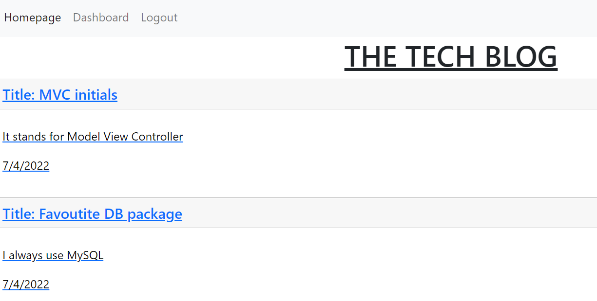

# Tech Blog

In this project, I was asked to build a CMS style blog site where other developers can publish their own content as well as comment on the posts of others. No starting code was provided and so the front and back end had to be built from scratch and to do so I utilised a numner of new packages including handlebars.js, sequalize, bcrypt and the express session npm package for authentication purposes

## Table of Contents

[Installation](#installation)

[Usage](#usage)

[Contributing](#contributing)

[License](#license)

[Questions](#questions)

[Links](#links)

## Installation

To install this you will need to run: 'npm install' on the command line

## Usage

To start this locally you will need to run node seed/index.js and then do npm start.

## Contributing

To contribute to this, clone the repo locally and commit on a seperate branch

## License

This application is covered under the following license: The Unlicence

## Links

You can see the deployed version of this by [clicking here](https://true-donair-40943.herokuapp.com/)

